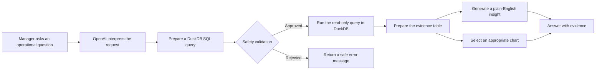

# TechSolve Support Operations AI Agent

A natural-language analytics prototype developed by **Kagna Em** for the Data & AI Specialist practical assessment.

[Open the live demonstration](https://techsolve-ai-agent-hluxmb69vkz3v4nhtqetzq.streamlit.app/)

## Project overview

The agent allows a manager to ask operational questions in plain English and receive a concise answer supported by an evidence table and an appropriate chart.

Example questions include:

- Which issue categories received the most tickets?
- Which teams had the highest SLA breach rates?
- How did monthly ticket demand change during 2024?
- How does demand compare between rainy and dry region-days?
- Did public holidays affect ticket volume?

The default reporting scope is **1 January 2024 to 31 December 2025**. The 2025 ticket extract is incomplete, so results should primarily be treated as a 2024 operational baseline.

## How it works

1. A manager enters a question in the Streamlit interface.
2. OpenAI interprets the question and prepares a DuckDB SQL query.
3. The application validates the query against its analytical controls.
4. DuckDB runs the approved read-only query on the prepared reporting tables.
5. The agent returns a plain-English explanation, the supporting data and a chart selected for the result.



## What the prototype demonstrates

- Natural-language access to operational data
- Ticket demand, issue, region, team and SLA analysis
- Public-holiday and regional-weather context
- Automatic chart selection for trends, distributions and comparisons
- Evidence-backed responses instead of unsupported narrative
- A deployable interface suitable for a management demonstration

## Data used

The prototype uses prepared analytical exports from the Power BI solution:

- Synthetic TechSolve support-ticket data
- A standardised issue-category hierarchy
- Date and New Zealand region dimensions
- New Zealand public-holiday data
- Historical regional weather data from Open-Meteo

Weather is joined to tickets using **both region and date**. Weather and holiday findings are described as associations, not proof of causation.

## Privacy and analytical controls

The public AI dataset excludes customer ID, customer name, customer email, billing contact email, account manager and assigned-to fields.

The application also applies the following controls:

- Approved analytical tables only
- Read-only `SELECT` or `WITH` queries
- One SQL statement per request
- Maximum of 200 result rows
- No access to customer-identifying or individual employee fields
- API credentials stored in Streamlit Community Cloud Secrets
- Results intended to be checked against the governed Power BI measures

## Technology

- **Streamlit** — interactive web interface
- **Python** — application and validation logic
- **OpenAI API** — natural-language interpretation and response generation
- **DuckDB** — local read-only analytical query engine
- **Power BI and Power Query** — data preparation, modelling, measures and dashboard validation
- **GitHub** — source control and deployment integration
- **Streamlit Community Cloud** — public demonstration hosting

## Limitations and possible improvements

This is an assessment prototype rather than a production application.

Current limitations include:

- The 2025 ticket extract is incomplete.
- The application uses exported analytical data rather than a live governed Power BI semantic-model connection.
- Generated interpretations should be validated for important management decisions.
- Weather comparisons show association only and do not establish causation.

A production version could connect to a governed warehouse or Power BI semantic model, use organisational authentication, add role-based access, retain an audit log and apply formal output monitoring.

## Run locally

The live demonstration can be used without installing anything. The following instructions are provided for reviewers who want to download the source code and run the prototype on their own computer.

1. Create a local `.env` file from `.env.example`.
2. Add `OPENAI_API_KEY` and, optionally, `OPENAI_MODEL`.
3. Install the required packages:

```powershell
pip install -r requirements.txt
```

4. Start the application:

```powershell
python -m streamlit run app.py
```

Never commit `.env` or `.streamlit/secrets.toml`.

## Responsible AI use

AI was used as a supporting tool for query planning and response generation. The data preparation, analytical definitions, model design, validation checks and final conclusions were reviewed against the source data and Power BI results.

---

**Developed by Kagna Em**  
Data & AI Specialist practical assessment
